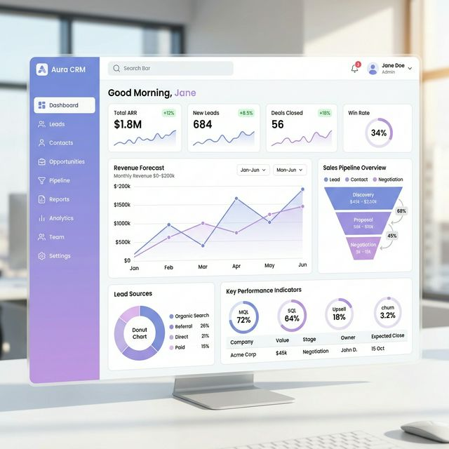
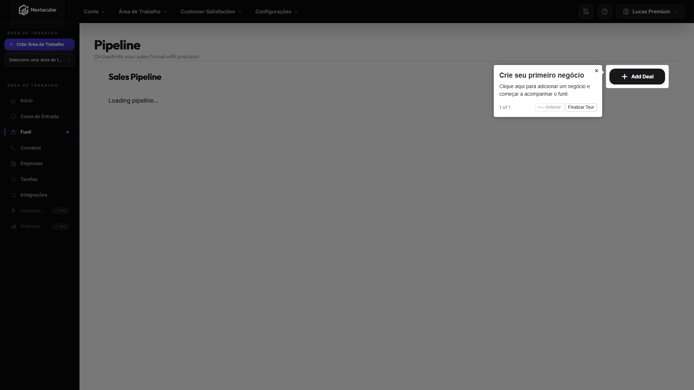
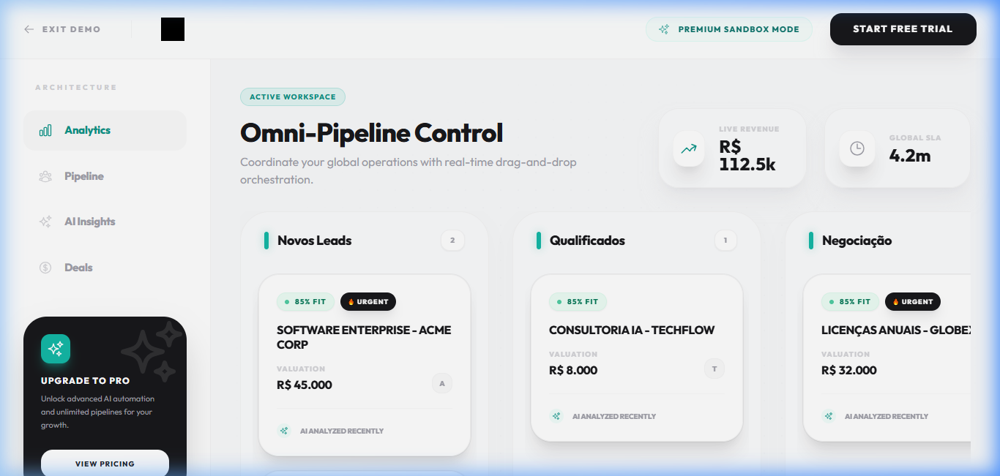

# Vysify CRM - Architecture Showcase 🚀

> **Note:** This repository is a technical showcase of the **Vysify CRM** architecture and design patterns. The full proprietary source code is maintained in a private repository to protect core intellectual property. 

Vysify is a modern, high-performance Customer Relationship Management (CRM) SaaS designed for scale, real-time interactions, and seamless onboarding. This document outlines the technical decisions, architecture, and tech stack used to build the platform from the ground up.

## 🛠 Tech Stack

The platform is built using a modern, type-safe, and highly scalable JavaScript/TypeScript ecosystem:

*   **Framework:** Next.js (App/Pages Router)
*   **Language:** TypeScript / JavaScript
*   **Database ORM:** Prisma (PostgreSQL)
*   **Authentication:** NextAuth.js
*   **Styling:** Tailwind CSS + Headless UI + Framer Motion
*   **Data Visualization:** Recharts & Visx (D3.js based)
*   **Payments & Billing:** Stripe
*   **Cloud Storage:** AWS S3
*   **Real-time Notifications:** Web-Push & Twilio
*   **Monitoring:** Sentry & Jest for testing

## 🏗 System Architecture

The architecture is designed following a monolithic front-to-back pattern using Next.js API routes, connected to a robust PostgreSQL database managed via Prisma. 

```mermaid
graph TD
    Client[Web Client (React / Next.js)] -->|HTTPS| LoadBalancer[CDN / Load Balancer]
    LoadBalancer --> NextJS[Next.js Server (Node.js)]
    
    subgraph Core Backend
        NextJS --> Auth[NextAuth.js]
        NextJS --> API[Next API Routes]
    end
    
    subgraph Data Layer
        API --> Prisma[Prisma ORM]
        Prisma --> DB[(PostgreSQL)]
    end
    
    subgraph Third-Party Integrations
        API --> Stripe[Stripe Billing]
        API --> AWS[AWS S3 Storage]
        API --> Twilio[Twilio SMS/WhatsApp]
    end
```

## ✨ Key Features & Engineering Highlights

### 1. Robust Security & Authentication
Implemented a custom NextAuth.js adapter to handle multi-tenant authentication securely. Includes password hashing with `bcryptjs` and session management.

### 2. High-Performance Data Visualization
Instead of relying on heavy charting libraries, Vysify utilizes `@visx` (by Airbnb) to render highly customized, low-level D3.js SVG components natively in React. This ensures buttery-smooth animations and responsive dashboards even with thousands of data points.

### 3. Real-time Notifications & PWAs
Vysify acts as a Progressive Web App (PWA) configured via `next-pwa`, featuring service workers (`workbox`) that manage offline caching and push notifications (`web-push`) directly to the user's device.

### 4. Modular Component Design
The UI is strictly modularized. We use a combination of `@headlessui/react` for accessible logic and `Tailwind CSS` for utility-first styling. Animations are handled gracefully by `framer-motion`.

## 📂 Repository Structure (Showcase)

While the full source is private, you can explore the `src/` directory in this showcase to see examples of:
- Clean code practices.
- Modular React components.
- Prisma schema design (Data Modeling).

---

### 📸 Screenshots


<br>

<br>

<br>

> **Are you a Recruiter or Hiring Manager?** 
> If you'd like a live demonstration of the product or wish to discuss the system architecture in detail, feel free to reach out to me!
